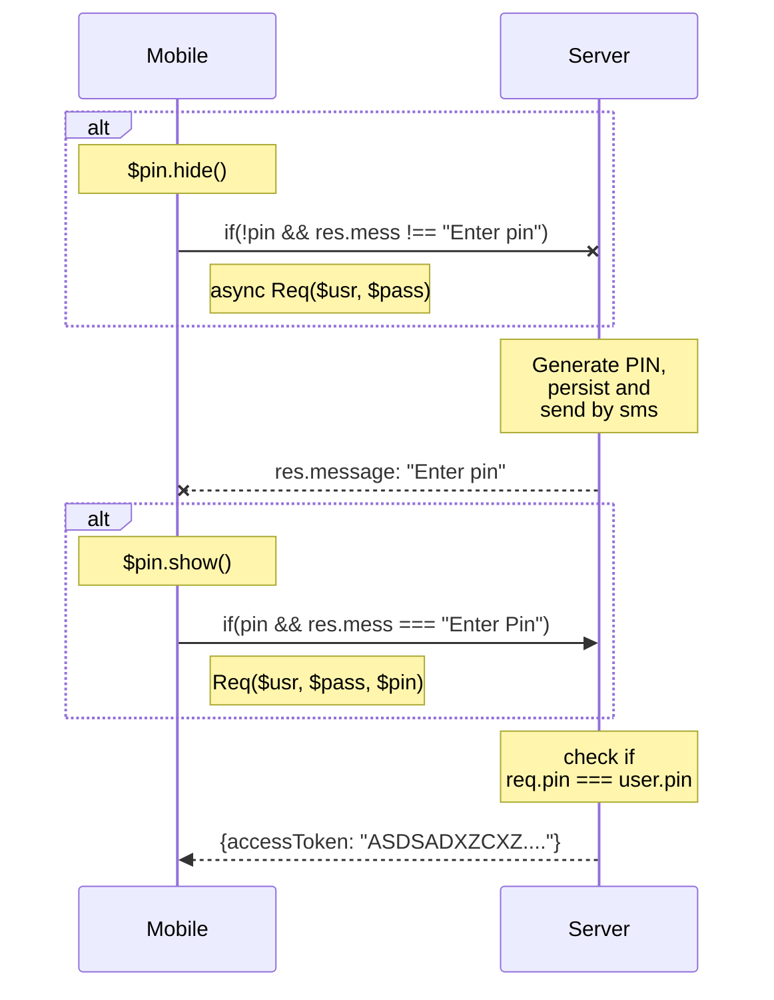

### 2 Factor Authentication

# 2FA - Login page

```mermaid
    sequenceDiagram
    alt
    note over Mobile: $pin.hide()
    Mobile-xServer: if(!pin && res.mess !== "Enter pin")
    note right of Mobile: async Req($usr, $pass)
    end
    note over Server: Generate PIN, <br> persist and <br> send by sms
    Server--xMobile: res.message: "Enter pin"
    alt
    note over Mobile: $pin.show()
    Mobile->>Server: if(pin && res.mess === "Enter Pin")
    note right of Mobile: Req($usr, $pass, $pin)
    end
    note over Server: check if <br> req.pin === user.pin
    Server-->>Mobile: {accessToken: "ASDSADXZCXZ...."}
```

