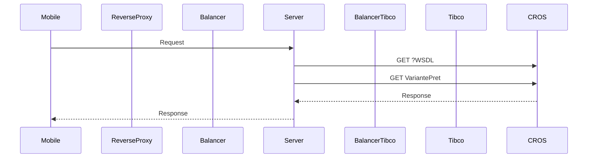
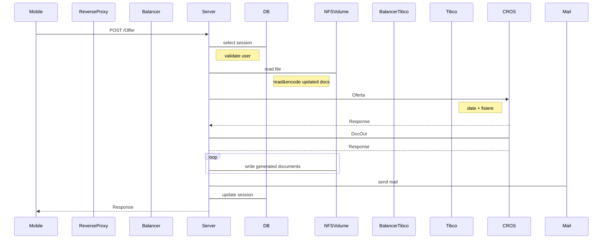
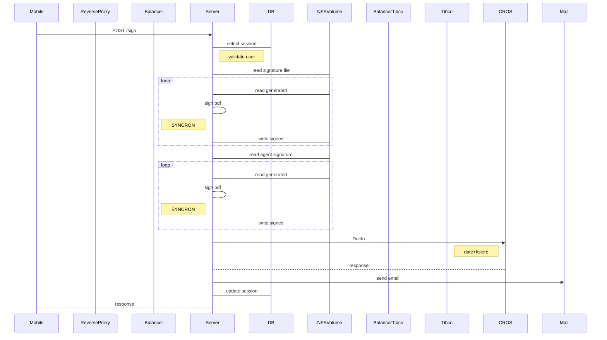

### Variante Pret

```mermaid

sequenceDiagram
    participant Mobile
    participant ReverseProxy
    participant Balancer
    participant Server
    participant BalancerTibco
    participant Tibco
    participant CROS
    Mobile->>Server: Request
    Server->>CROS: GET ?WSDL
    Server->>CROS: GET VariantePret
    CROS-->>Server: Response
    Server-->>Mobile: Response
```

### Oferta

```mermaid

sequenceDiagram
    participant Mobile
    participant ReverseProxy
    participant Balancer
    participant Server
    participant DB
    participant NFSVolume
    participant BalancerTibco
    participant Tibco
    participant CROS
    participant Mail
    Mobile->>Server: POST /Offer
    Server->DB: select session
    note left of DB: validate user
    Server->NFSVolume: read file
    note left of NFSVolume: read&encode updated docs
    Server->>CROS: Oferta
    note left of CROS: date + fisiere
    CROS-->>Server: Response
    Server->CROS: DocOut
    CROS-->Server: Response
    loop
       Server->NFSVolume: write generated documents
    end
    Server->Mail: send mail
    Server->DB: update session
    Server-->>Mobile: Response
```

### Semnatura

```mermaid

sequenceDiagram
    participant Mobile
    participant ReverseProxy
    participant Balancer
    participant Server
    participant DB
    participant NFSVolume
    participant BalancerTibco
    participant Tibco
    participant CROS
    participant Mail
    Mobile->>Server: POST /sign
    Server->DB: select session
    note left of DB: validate user
    Server->NFSVolume: read signature file
    loop
       Server->NFSVolume: read generated
       Server->Server: sign pdf
       note left of Server: SYNCRON
       Server->NFSVolume: write signed
    end
    Server->NFSVolume: read agent signature
    loop
        Server->NFSVolume: read generated
        Server->Server: sign pdf
        note left of Server: SYNCRON
        Server->NFSVolume: write signed
    end
    Server->>CROS: DocIn
    note left of CROS: date+fisiere
    CROS-->Server: response
    Server->>Mail: send email
    Server->DB: update session
    Server-->Mobile: response
```