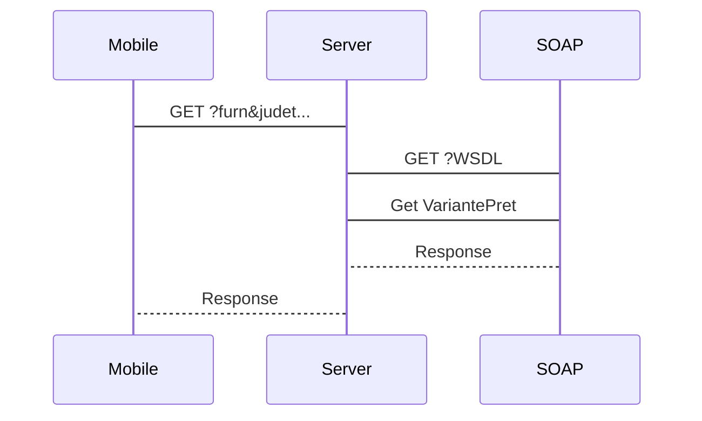
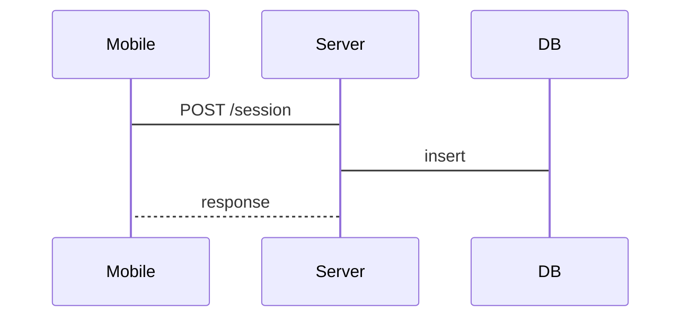
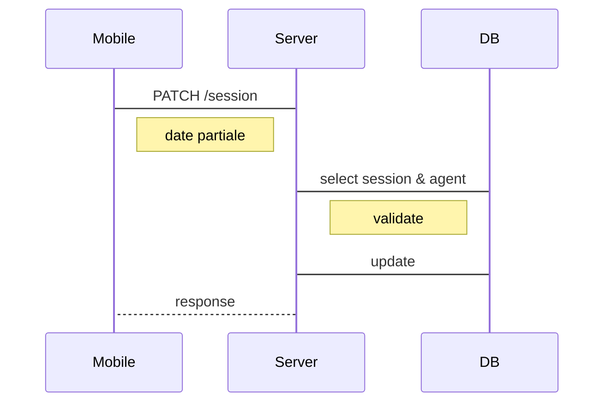
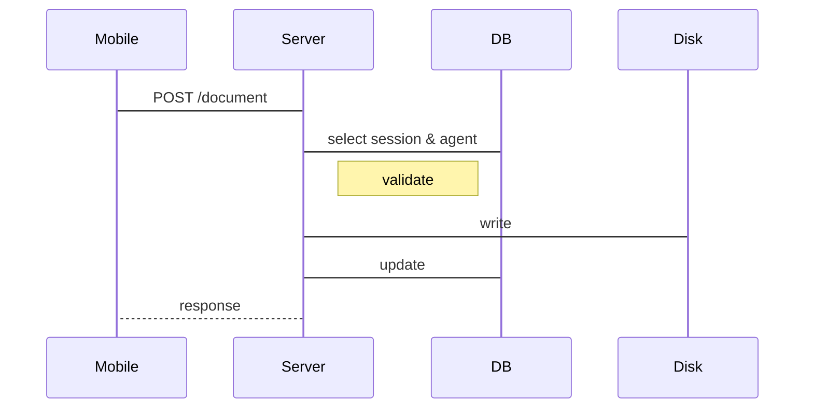
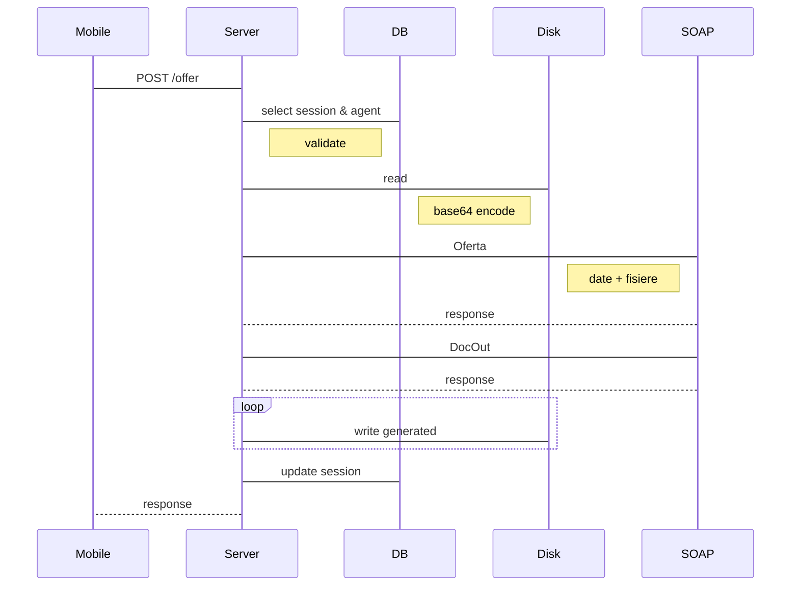
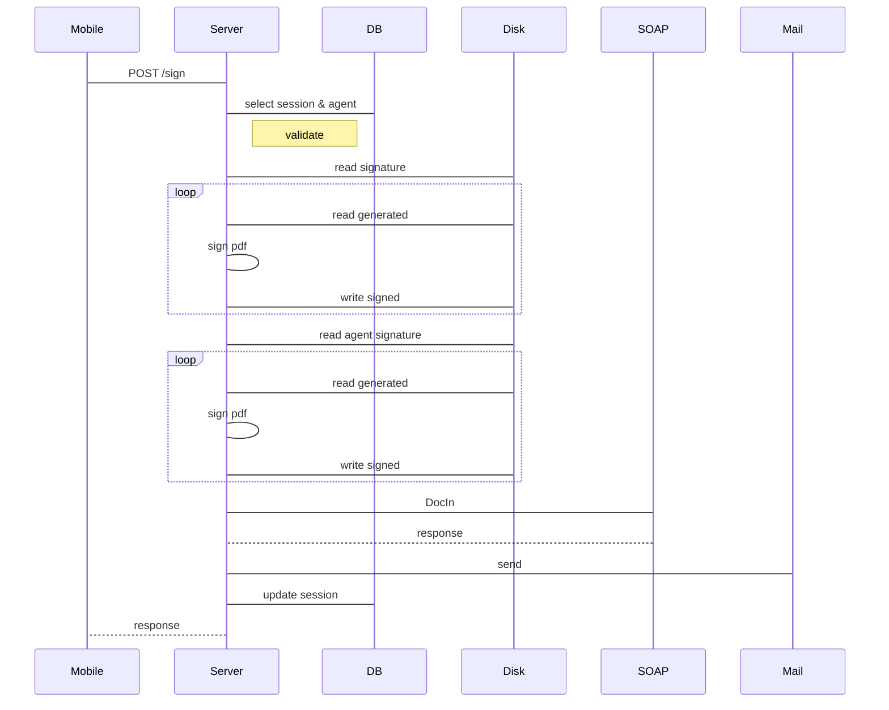

### Variante Pret

```mermaid
sequenceDiagram
Mobile->Server: GET ?furn&judet...
Server->SOAP: GET ?WSDL
Server->SOAP: Get VariantePret
SOAP-->Server: Response
Server-->Mobile: Response
```

### Sesiune
New

```mermaid
sequenceDiagram
Mobile->Server: POST /session
Server->DB: insert
Server-->Mobile: response
```
Update

```mermaid
sequenceDiagram
Mobile->Server: PATCH /session
note left of Server: date partiale
Server->DB: select session & agent
note left of DB: validate
Server->DB: update
Server-->Mobile: response
```
Documente

```mermaid
sequenceDiagram
Mobile->Server: POST /document
Server->DB: select session & agent
note left of DB: validate
Server->Disk: write
Server->DB: update
Server-->Mobile: response
```

### Oferta

```mermaid
sequenceDiagram
Mobile->Server: POST /offer
Server->DB: select session & agent
note left of DB: validate
Server->Disk: read
note left of Disk: base64 encode
Server->SOAP: Oferta
note left of SOAP: date + fisiere
SOAP-->Server: response
Server->SOAP: DocOut
SOAP-->Server: response
loop
    Server->Disk: write generated
end
Server->DB: update session
Server-->Mobile: response
```

### Semnatura

```mermaid
sequenceDiagram
Mobile->Server: POST /sign
Server->DB: select session & agent
note left of DB: validate
Server->Disk: read signature
loop
    Server->Disk: read generated
    Server->Server: sign pdf
    Server->Disk: write signed
end
Server->Disk: read agent signature
loop
    Server->Disk: read generated
    Server->Server: sign pdf
    Server->Disk: write signed
end
Server->SOAP: DocIn
SOAP-->Server: response
Server->Mail: send
Server->DB: update session
Server-->Mobile: response
```